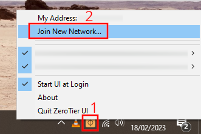
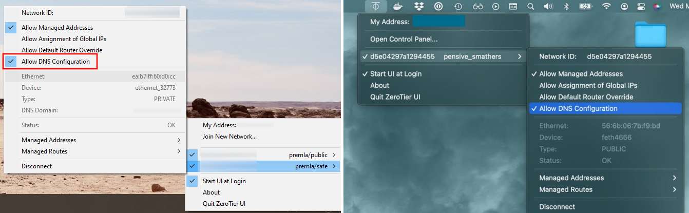
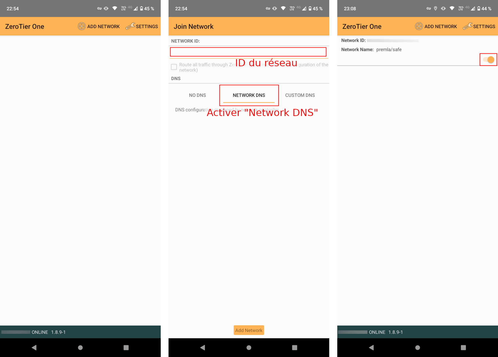
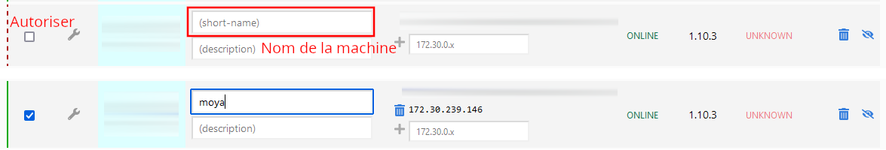

# Connecter une machine utilisateur au VPN

## Configuration du client

## Windows et macOS

Commencez par [installer le client ZeroTier One](https://www.zerotier.com/download/).

Une fois cela fait, joignez le réseau à l'aide de son identifiant alphanumérique (16 caractères) :



Ensuite, vous devez activer l'option `Allow DNS configuration` (non active par défaut) dans l'interface graphique.



Enfin, l'administrateur du réseau ZeroTier doit autoriser la machine dans son interface d'administration.

## Android

Commencez par [installer le client ZeroTier One](https://www.zerotier.com/download/).

Une fois cela fait, joignez le réseau à l'aide de son identifiant alphanumérique (16 caractères) :



Pensez bien à activer l'onglet "Network DNS" comme illustré dans la capture ! Pour finir, l'administrateur du réseau ZeroTier doit autoriser la machine dans son interface d'administration.

## Linux

Commencez par installer le service ZeroTier One, ainsi que le petit outil `rezolved` qui est nécessaire sur Linux pour l'application des réglages DNS paramétrés dans ZeroTier :

```sh
sudo apt update
sudo apt install gpg

sudo curl -s 'https://raw.githubusercontent.com/zerotier/ZeroTierOne/master/doc/contact%40zerotier.com.gpg' | gpg --import && \
    if z=$(curl -s 'https://install.zerotier.com/' | gpg); then echo "$z" | sudo bash; fi
sudo apt install zerotier-one

curl -sL 'https://framagit.org/interhop/mla/-/raw/main/tools/rezolved/install.sh' | bash
```

Ensuite, vous pouvez joindre le réseau de cette manière :

```sh
sudo zerotier-cli info # Donne l'ID de la machine client

sudo zerotier-cli join <network ID>
sudo zerotier-cli set <network ID> allowDNS=1
```

Attendez jusqu'à une minute après la configuration pour que les changements soient effectifs.

## Autorisation de la machine sur ZeroTier Central

L'administrateur du réseau ZeroTier concerné doit autoriser la machine au sein de l'interface web, et lui assigner un nom facile à identifier (optionnel mais recommandé).

L'interface d'administration est accessible ici : https://zt.premla.fr/



# Environnements (stages)

## Préproduction

Cet environnement est déployé sur une instance OVHcloud comprenant 4 instances, et un nom de domaine `premla.fr` enregistré via Gandi.

Les domaines suivants sont accessibles publiquement :

- https://premla.fr/ (WordPress)
- https://leaks.premla.fr/ (Globaleaks)

Les domaines suivants sont accessibles via le VPN :

- https://cloud.intra.premla.fr/ (Nextcloud)
- https://monitor.intra.premla.fr/ (Grafana)
- https://wekan.intra.premla.fr/ (Wekan)

## Vagrant

Il s'agit d'un environnement de test, entièrement local (machines virtuelles vagrant), sans VPN et avec des certificats SSL auto-signés.

Les domaines comprennent :

- https://mla.local/ (WordPress)
- https://leaks.mla.local/ (Globaleaks)
- https://cloud.intra.mla.local/ (Nextcloud)
- https://monitor.intra.mla.local/ (Grafana)
- https://wekan.intra.mla.local/ (Wekan)

# Architecture globale

L'environnement de production et celui de préproduction utilisent chacun deux réseaux VPN basés sur ZeroTier :

- Les machines vulnérables (accès publique) sont sur le réseau `mla/public` (ou `premla/public`). L'accès SSH à ces machines nécessite de passer par ce réseau. Ces machines ont un nom commençant par `pub_`.
- Les machines sécurisées (accès privé) sont sur le réseau `mla/safe` (ou `premla/safe`). L'accès SSH à ces machines nécessite de passer par ce réseau. Ces machines n'ont pas d'IP publique et sont donc totalement inaccessibles en dehors du VPN. Ces machines ont un nom commençant par `pri_`.

La machine utilisée pour le déploiement Ansible doit être connectée aux deux réseaux privés au moment du déploiement !

# Déploiement Ansible

## Environnement de préproduction (PreMLA)

La machine utilisée pour le déploiement doit être connectée aux deux réseaux VPN décrits ci-dessous. Idéalement, l'accès de cette machine aux deux réseaux n'est activé que temporairement lors des déploiements, en passant par l'interface d'administration ZeroTier.

Par ailleurs, l'utilisation de ce playbook nécessite la possession de la clé Ansible Vault privée, qui ne doit **en aucun cas être enregistrée dans le dépôt** ! A cette fin, le fichier `.gitignore` est paramétré pour ignorer les fichiers ayant l'extension `.vault`.

Une fois les deux réseaux ZeroTier connectés et la clé en votre posession, vous pouvez lancer le déploiement complet avec la commande suivante :

```sh
ansible-playbook mla.yml -i inventories/preprod --vault-password-file ansible_mla.vault
```

## Environnement Vagrant

```sh
sudo apt install vagrant vagrant-hostmanager

cd vagrant
vagrant up
ansible-playbook ../mla.yml -i ../inventories/vagrant --vault-password-file ../ansible_mla.vault
```

# Stratégie de sauvegarde

## Snapshots des disques

Les machines OVH sont configurées de manière à réaliser un snapshot quotidien des disques, chaque nuit.

## Copie chiffrée à distance des fichiers

Une sauvegarde nocture des données est réalisée quotidiennement, elle comprend deux étapes :

- Export des données spécifiques des services
- Synchronisation chiffrée des données vers rsync.net (prestataire hors OVH)

### Export des données

Toutes les applications sont paramétrées pour stocker leurs données dans `/opt`, soit directement, soit via des dumps quotidiens pour certains services :

- MariaDB
- Globaleaks (rsync et backup sqlite3)

### Synchronisation rclone

Chaque serveur de production (et de préproduction) est configuré pour réaliser des backups chiffrés sur rsync.net via rclone (en SFTP). Le chiffrement symétrique repose sur un mot de passe aléatoire de 64 caractères.

Tout le contenu du répertoire `/opt` est compris dans chaque synchronisation.

Des snapshots du disque rsync.net sont réalisés de manière automatique et quotidienne, avec un roulement qui comprend :

- Les 7 derniers snapshots quotidiens
- Les 2 derniers snapshots hebdomadaires (remontant donc à 3 semaines)
- Les 2 derniers snapshots mensuels (remontant donc à 2 mois et 3 semaines)

### Système d'alerte

Des avertissements sont mis en place pour avertir les administrateurs par mail et SMS :

- Erreur lorsqu'un ou plusieurs services systemd (dont les backups) échoue, ou de la modification des unités actives **[WIP]**
- Alertes venant de rsync.net 

### Test des backups

Une séance mensuelle de restauration des données de production (à partir des backups) vers un environnement virtual local est effectuée. Cette séance est sous la responsabilité d'InterHop.

Ces tests sont effectuées sur une machine hôte locale dédiée à cet usage, et les machines virtuelles sont supprimées après le test.

# Commandes utiles

## Connexion ZeroTier d'un nouveau serveur

```sh
sudo apt update
sudo apt install gpg

sudo curl -s 'https://raw.githubusercontent.com/zerotier/ZeroTierOne/master/doc/contact%40zerotier.com.gpg' | gpg --import && \
    if z=$(curl -s 'https://install.zerotier.com/' | gpg); then echo "$z" | sudo bash; fi

sudo zerotier-cli join <network ID>
```
