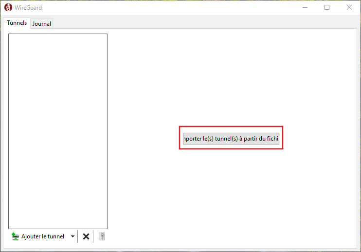
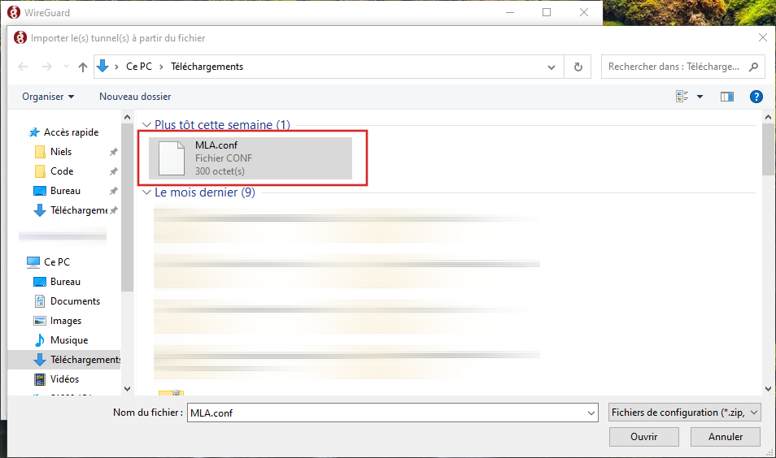
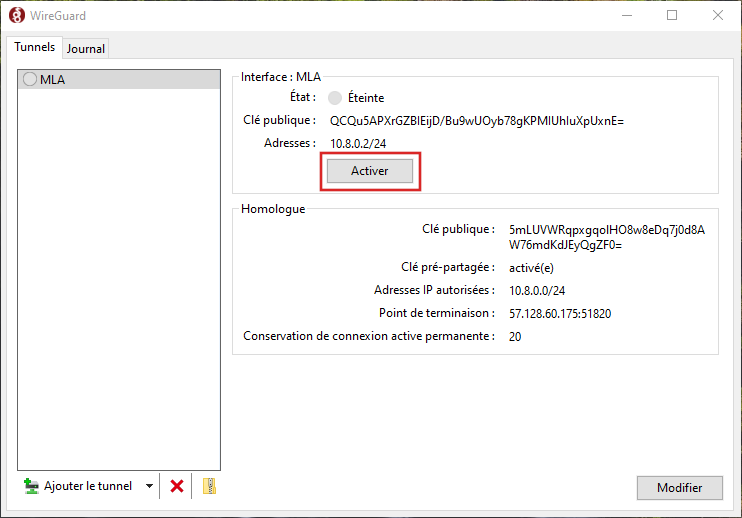
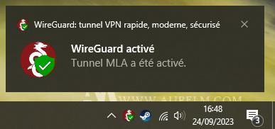
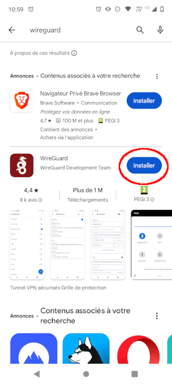
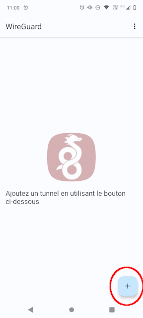
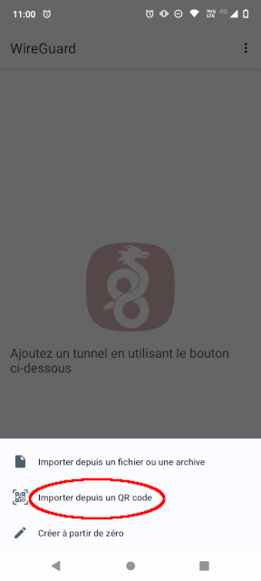
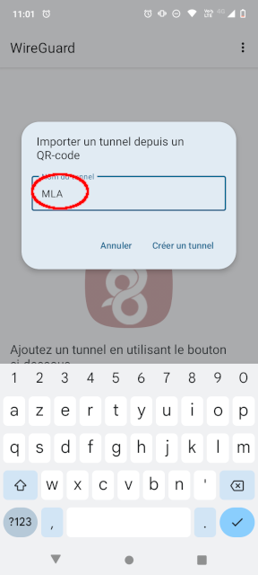
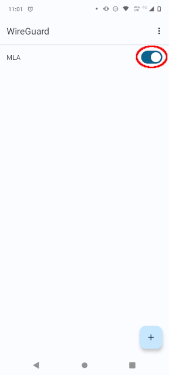
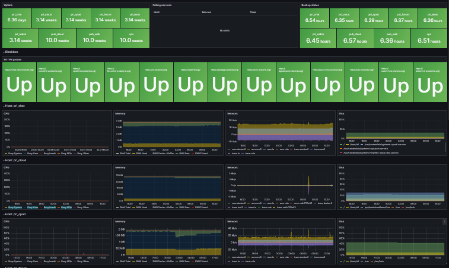

# Connecter une machine utilisateur au VPN

## Configuration du client

Il faut d'abord configurer l'accès sur https://vpn.mlalerte.org/, et télécharger le fichier de configuration produit. Une fois ce fichier récupéré, suivez les instructions correspondant à votre système d'exploitation.

## Linux

Exécutez les commandes suivantes dans un terminal sur la machine client :

```sh
sudo apt install wireguard

sudo vim /etc/wireguard/mla.conf
# Paste config you got from vpn.mlalerte.org

sudo systemctl enable wg-quick@mla
sudo systemctl start wg-quick@mla
```

## Windows et macOS

Commencez par installer WireGuard [depuis la page de téléchargement](https://www.wireguard.com/install/) du site officiel.

Une fois WireGuard installé et mis en route, vous devriez avoir une fenêtre comme celle-ci :



Utilisez le bouton central pour ajouter un tunnel VPN, et sélectionnez le fichier de configuration *MLA.conf* qui vous a été envoyé par mail.



Vous pouvez ensuite activer le VPN à l'aide du bouton *Activer* qui s'affiche, comme illustré ci-dessous :



Le système d'exploitation affichera une notification en cas de connexion réussie.



## Android

Commencez par installer [WireGuard depuis le Play Store](https://play.google.com/store/apps/details?id=com.wireguard.android).



Une fois WireGuard installé et visible à l'écran, cliquez sur le bouton **+** pour importer un nouveau VPN. Utilisez l'option QR Code, et scanner le QR Code disponible dans le mail qui vous a été envoyé.





Ensuite, vous pouvez nommer la connexion VPN, nous suggérons *MLA* mais c'est un choix libre.



Par défaut ce VPN n'est pas activé, ouvrez l'application WireGuard et activez le VPN quand vous en avez besoin.



# Environnements (stages)

## Production

Cet environnement est déployé sur une instance OVHcloud comprenant plusieurs instances, et un nom de domaine `mlalerte.org` (et `mlalerte.fr`) enregistré via Gandi.

Les domaines suivants sont accessibles publiquement :

- https://mlalerte.org/ (WordPress)
- https://partage.mlalerte.org/ (Nextcloud)
- https://signalement.mlalerte.org/ (Globaleaks)
- https://vpn.mlalerte.org/ (Wireguard Easy)

Les domaines suivants sont accessibles via le VPN :

- https://chat.intra.mlalerte.org/ (Mattermost)
- https://cloud.intra.mlalerte.org/ (Nextcloud)
- https://forum.intra.mlalerte.org/ (Discourse)
- https://vault.intra.mlalerte.org/ (Vaultwarden)
- https://wekan.intra.mlalerte.org/ (Wekan)

## Vagrant

Il s'agit d'un environnement de test, entièrement local (machines virtuelles vagrant), sans VPN et avec des certificats SSL auto-signés.

Les domaines comprennent :

- https://mla.local/ (WordPress)
- https://partage.mla.local/ (Nextcloud)
- https://signalement.mla.local/ (Globaleaks)

Ainsi que ceux-ci, protyégés par VPN dans le déploiement en production :

- https://chat.intra.mla.local/ (Mattermost)
- https://cloud.intra.mla.local/ (Nextcloud)
- https://forum.intra.mla.local/ (Discourse)
- https://vault.intra.mla.local/ (Vaultwarden)
- https://wekan.intra.mla.local/ (Wekan)

# Déploiement Ansible

Vous devez être connecté au VPN de la MLA pour pouvoir effectuer un déploiement Ansible !

## Environnement de production (MLA)

La machine utilisée pour le déploiement doit être connectée au réseau VPN décrit ci-dessus. Idéalement, l'accès de cette machine au VPN n'est activé que temporairement lors des déploiements, en passant par l'interface d'administration Wireguard Easy.

Par ailleurs, l'utilisation de ce playbook nécessite la possession de la clé Ansible Vault privée, qui ne doit **en aucun cas être enregistrée dans le dépôt** ! A cette fin, le fichier `.gitignore` est paramétré pour ignorer les fichiers ayant l'extension `.vault`.

Avec la connexion au VPN activée et la clé en votre posession, vous pouvez lancer le déploiement complet avec la commande suivante :

```sh
ansible-playbook mla.yml -i mla/inventories/prod --vault-password-file keys/mla.vault
```

## Environnement Vagrant

```sh
sudo apt install vagrant vagrant-hostmanager

cd vagrant
vagrant up
ansible-playbook ../mla.yml -i mla/inventories/vagrant --vault-password-file keys/mla.vault
```

# Stratégie de sauvegarde

## Snapshots des disques

Les machines OVH sont configurées de manière à réaliser un snapshot quotidien des disques, chaque nuit.

## Copie chiffrée à distance des fichiers

Une sauvegarde nocture des données est réalisée quotidiennement, elle comprend deux étapes :

- Export des données spécifiques des services
- Synchronisation chiffrée des données vers rsync.net (prestataire hors OVH)

### Export des données

Toutes les applications sont paramétrées pour stocker leurs données dans `/opt`, soit directement, soit via des dumps quotidiens pour certains services :

- MariaDB
- MongoDB
- Globaleaks (rsync et backup sqlite3)
- PostgreSQL

### Synchronisation rekkord

Chaque serveur de production (et de préproduction) est configuré pour réaliser des backups chiffrés sur rsync.net via rekkord (en SFTP). Le chiffrement asymétrique repose sur un mot de passe aléatoire de 32 caractères.

Tout le contenu du répertoire `/opt` est compris dans chaque synchronisation.

Des snapshots du disque rsync.net sont réalisés de manière automatique et quotidienne, avec un roulement qui comprend :

- Les 3 derniers snapshots quotidiens
- Les 2 derniers snapshots hebdomadaires (remontant donc à 3 semaines)
- Les 2 dernier snapshot mensuels (remontant donc à 2 mois et 3 semaines)

### Système d'alerte

Un monitoring par Prometheus et Grafana est mis en place pour les serveurs et les services de la MLA.



En plus de ce tableau de bord, des alertes mails et Discord sont configurées en cas d'anomalie :

- Panne d'un serveur OVH
- Panne d'un service web de la MLA, détecté par des sondes HTTPS exécutées toutes les 2 minutes (y compris pour l'intranet VPN)
- Espace disque < 5%
- Erreur lorsqu'un ou plusieurs services systemd échoue
- Erreur lors du backup rekkord quotidien
- Ancienneté excessive d'un backup (> 28 heures)
- Alertes venant de rsync.net en cas d'absence de nouvelle données

Par ailleurs, le serveur/collecteur Prometheus/Grafana est paramétré pour signaler son propre fonctionnement à healthchecks.io. En cas de panne du collecteur lui-même, le service externe healthchecks.io envoie une alerte mail et Discord.

### Test des backups

Une séance mensuelle de restauration des données de production (à partir des backups) vers un environnement virtuel local est effectuée. Cette séance est sous la responsabilité d'InterHop.

Ces tests sont effectuées sur une machine hôte locale dédiée à cet usage, et les machines virtuelles sont supprimées après le test.

# Commandes utiles

## Connexion WireGuard d'un nouveau serveur

```sh
sudo apt install wireguard

sudo vim /etc/wireguard/mla.conf
# Paste config you got from vpn.mlalerte.org

sudo systemctl enable wg-quick@mla
sudo systemctl start wg-quick@mla
```
