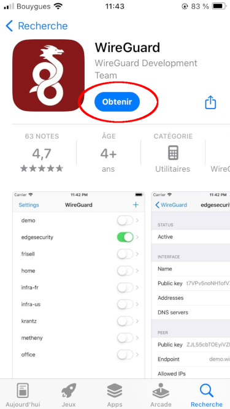
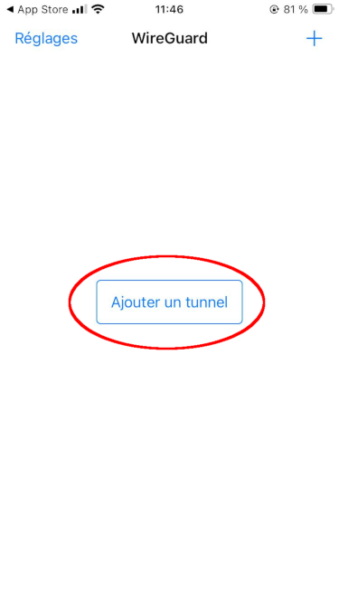
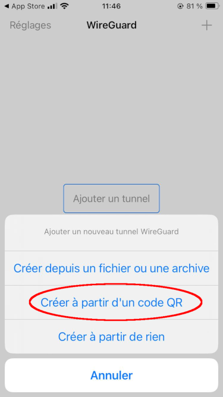
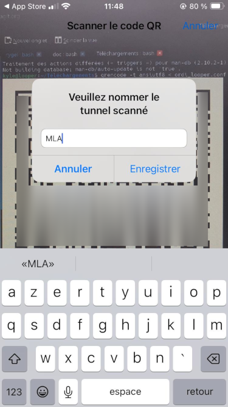
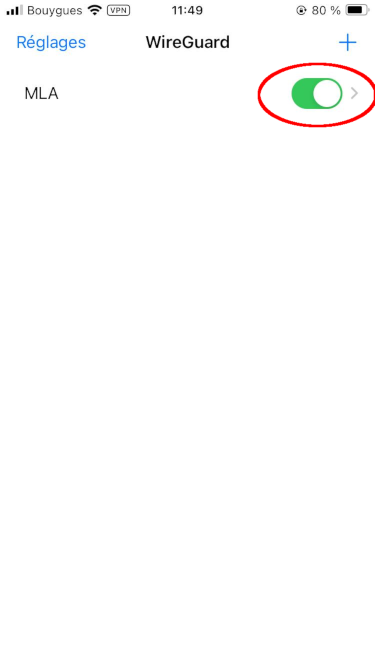
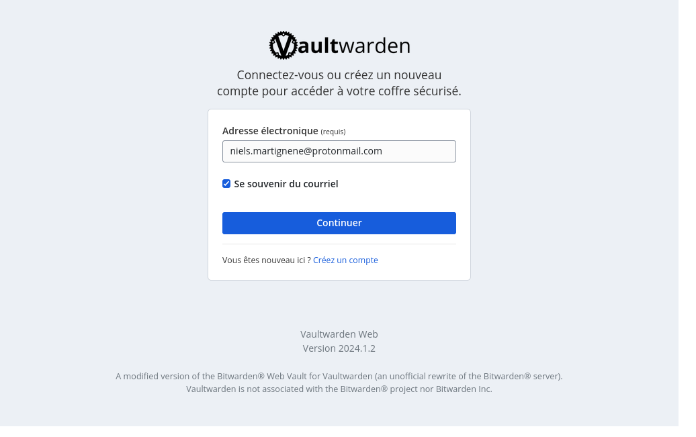

* [Introduction](#introduction)
* [Connexion au VPN](#connexion-au-vpn)
   * [Windows et macOS](#windows-et-macos)
   * [Linux](#linux)
   * [Android](#android)
   * [iPhone](#iphone)
* [Centralisation des identifiants (Vault)](#centralisation-des-identifiants-vault)
* [Services web](#services-web)

# Introduction

Pour accéder aux services internes de la MLA, il faut tout d'abord :

- Configurer la [connexion au VPN](#connexion-au-vpn)
- Puis accéder au gestionnaitre d'identifiants et [mots de passe Vaultwarden](#centralisation-des-identifiants-vault)

# Connexion au VPN

Pour pouvoir se connecter au VPN, un [administrateur](mailto:niels.martignene@protonmail.com) doit d'abord vous avoir envoyé le fichier MLA.conf personnalisé.

## Windows et macOS

Commencez par installer WireGuard [depuis la page de téléchargement](https://www.wireguard.com/install/) du site officiel.

Une fois WireGuard installé et mis en route, vous devriez avoir une fenêtre comme celle-ci :


Utilisez le bouton central pour ajouter un tunnel VPN, et sélectionnez le fichier de configuration *MLA.conf* qui vous a été envoyé par mail.


Vous pouvez ensuite activer le VPN à l'aide du bouton *Activer* qui s'affiche, comme illustré ci-dessous :


Le système d'exploitation affichera une notification en cas de connexion réussie.


## Linux

Exécutez les commandes suivantes dans un terminal sur la machine client :

```sh
sudo apt install wireguard

sudo vim /etc/wireguard/mla.conf
# Paste config you got from vpn.mlalerte.org

sudo systemctl enable wg-quick@mla
sudo systemctl start wg-quick@mla
```

## Android

Commencez par installer [WireGuard depuis le Play Store](https://play.google.com/store/apps/details?id=com.wireguard.android).


Une fois WireGuard installé et visible à l'écran, cliquez sur le bouton **+** pour importer un nouveau VPN. Utilisez l'option QR Code, et scanner le QR Code disponible dans le mail qui vous a été envoyé.


Ensuite, vous pouvez nommer la connexion VPN, nous suggérons *MLA* mais c'est un choix libre.


Par défaut ce VPN n'est pas activé, ouvrez l'application WireGuard et activez le VPN quand vous en avez besoin.


## iPhone

Commencez par installer [WireGuard depuis l'App Store](https://apps.apple.com/us/app/wireguard/id1441195209).



Une fois WireGuard installé et visible à l'écran, cliquez sur le bouton **+** pour importer un nouveau VPN. Utilisez l'option QR Code, et scanner le QR Code disponible dans le mail qui vous a été envoyé.





Ensuite, vous pouvez nommer la connexion VPN, nous suggérons *MLA* mais c'est un choix libre.



Par défaut ce VPN n'est pas activé, ouvrez l'application WireGuard et activez le VPN quand vous en avez besoin.



# Centralisation des identifiants (Vault)

Les comptes créés par l'administrateur pour accéder aux différents services sont répertoriés dans un gestionnaire de mots de passe accessible via le VPN, qui repose sur Vaultwarden.

Une fois connecté au VPN, accédez-y ici : https://vault.intra.mlalerte.org/



Utilisez les identifiants spécifiques au Vault qui vous ont été transmis par mail. Une fois connecté à votre coffre-fort, vous pourrez accéder aux identifiants et mots de passe des autres services (cloud, chat, etc.).

# Services web

Cet environnement est déployé sur une instance OVHcloud comprenant plusieurs instances, et un nom de domaine `mlalerte.org` (et `mlalerte.fr`) enregistré via Gandi.

Les domaines suivants sont accessibles publiquement :

- https://mlalerte.org/ (WordPress)
- https://partage.mlalerte.org/ (Nextcloud)
- https://signalement.mlalerte.org/ (Globaleaks)
- https://vpn.mlalerte.org/ (Wireguard Easy)

Les domaines suivants sont accessibles via le VPN :

- https://chat.intra.mlalerte.org/ (Mattermost)
- https://cloud.intra.mlalerte.org/ (Nextcloud)
- https://forum.intra.mlalerte.org/ (Discourse)
- https://vault.intra.mlalerte.org/ (Vaultwarden)
- https://wekan.intra.mlalerte.org/ (Wekan)
